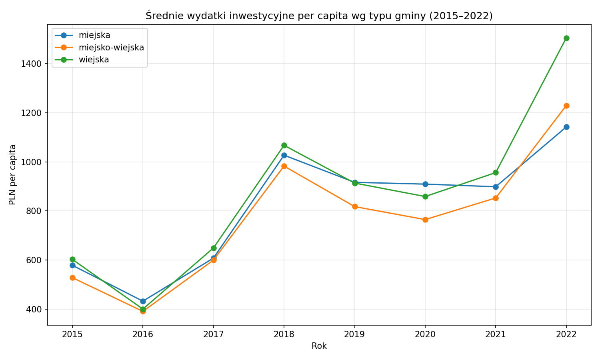
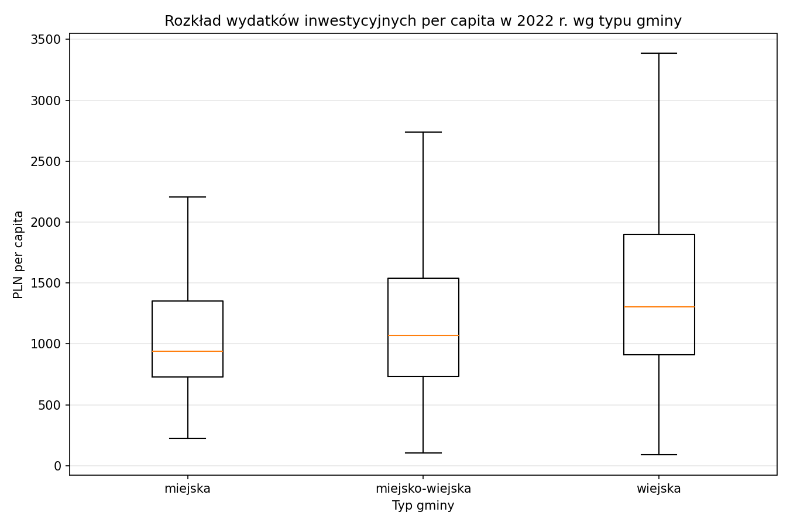
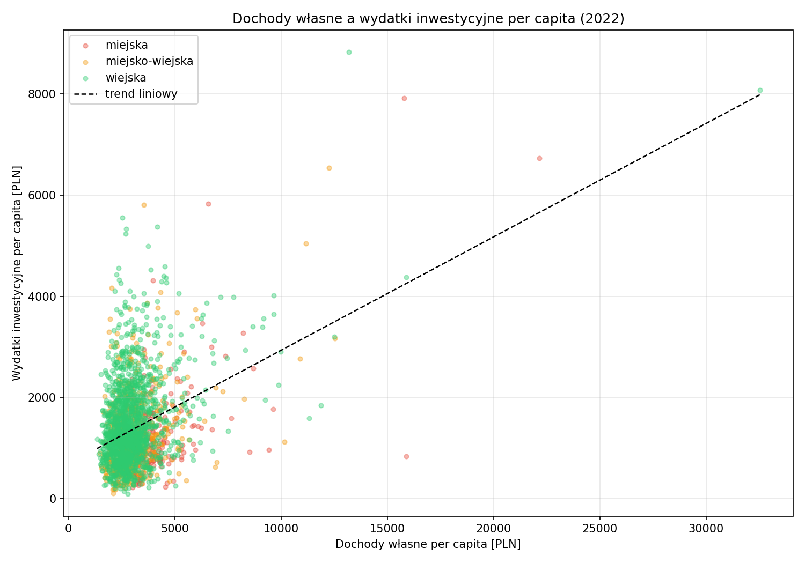
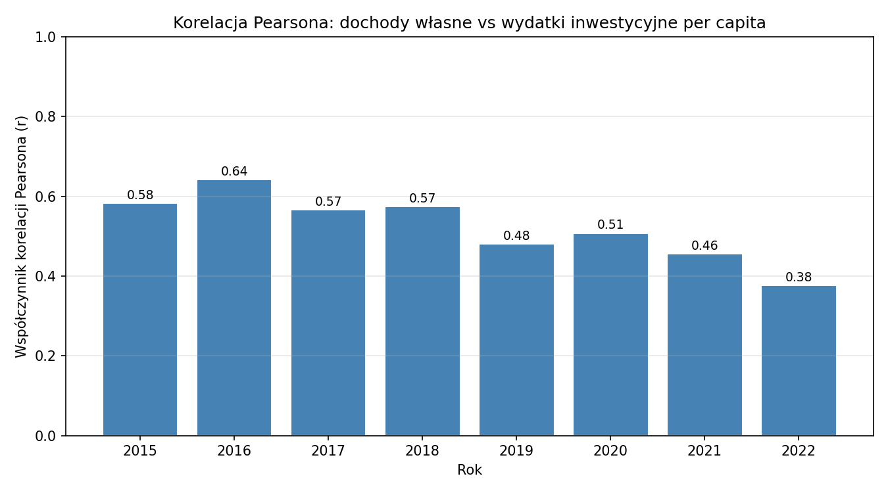

# Wydatki inwestycyjne gmin w Polsce w latach (2015-2022)

Projekt analizuje zroznicowanie wydatkow inwestycyjnych gmin w Polsce w latach 2015-2022 na podsstawie danych BDL GUS.

## Cel analizy

Zbadanie zwiazku miedzy dochodami wlasnymi a wydatkami inwestycyjnymi oraz powonanie tych wartosci miedzy typami gmin (miejska, wiejska, miejsko-wiejska)

## Dane

Zrodlo: https://bdl.stat.gov.pl/bdl/dane/podgrup/temat

| Zmienna                        | Opis                                   |
| Dochody własne                 | Łączne dochody własne gminy [zł]       |
| Wydatki majątkowe inwestycyjne | Wydatki na inwestycje [zł]             |
| Ludność                        | Stan na 31 grudnia danego roku [osoby] |

- Liczba gmin w probie: 2 578
- Zakres czasowy: 2015–2022
- Zmienne finansowe przeliczone na mieszkanca (per capita)

## Wyniki

### Zroznicowanie wg typu gmny (srednia 2015-2022)

| Typ gminy       | Wydatki inwest. pc [PLN] | Dochody wlasne pc [PLN] |
| miejska         | 812,69                   | 2 888,35                |
| miejsko-wiejska | 791,58                   | 2 171,98                |
| wiejska         | 863,58                   | 1 944,36                |

Gminy wiejskie, mimo najnizszych dochodow wlasnych, wykazuja nawieksze srednie wydatki inwestycyjne co moze swiadczyc o silnym korzystaniu ze srodkow UE i transferow rzadowych

### Korelacja dochodow wlasnych z wydatkami inwestycyjnymi

Wspolczynnik korelacji miedzy dochodami wlasnymi per capita a wydatkami inwestycyjnymi per capita spada z 0,64 do 0,38 co oznacza slabnocy zwiazek miedzy zamoznoscia gminy a jej aktywnoscia inwestycyjnych. Prawdopodobnie rosnie rola zewnetrznych xrodel finansowania, ktore niweluja przewage gmin bogatszych

### Skrajne przypadki

Top 3 najwyzszych wydatkow inwestycyjnych pc (srednia 2015–2022):
- Kleszczow (gmina wiejska) — 12 553 PLN/os. (gmina z elektrownia Belchatow)
- Krynica Morska (gmina miejska) — 4 801 PLN/os.
- Swinoujscie (gmina miejska) — 4 799 PLN/os.

Top 3 najniższych:
- Ostrowice (gmina wiejska) — 26 PLN/os. (gmina rozwiazana w 2019 r. z powodu bankructwa)
- Bielice (gmina wiejska) — 181 PLN/os.
- Markusy (gmina wiejska) — 200 PLN/os.

## Wykresy

### Trend wydatkow inwestycyjnych per capita wg typu gminy


### Rozklad wydatków inwestycyjnych per capita w 2022 r.


### Dochody w;asne a wydatki inwestycyjne per capita (2022)


### Korelacja Pearsona wg roku


## Technologie

- Python 3.13
- pandas, matplotlib, seaborn, numpy

## Uruchomienie

```bash
pip install -r requirements.txt
python analiza.py
```